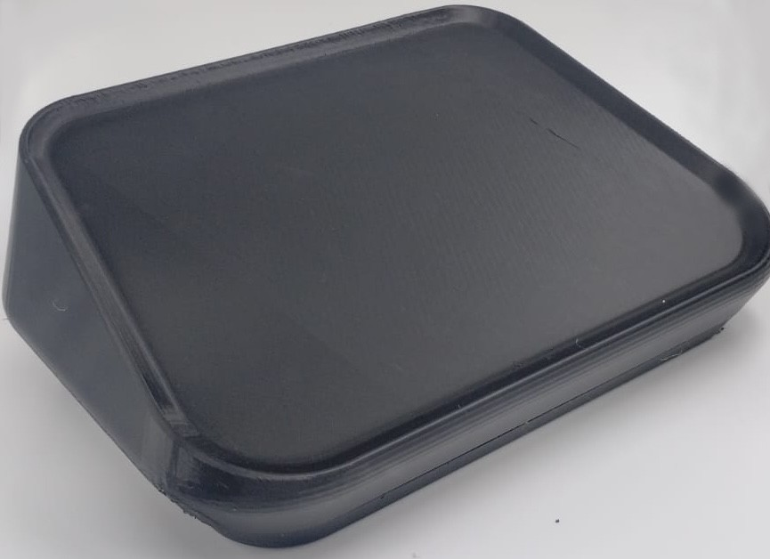
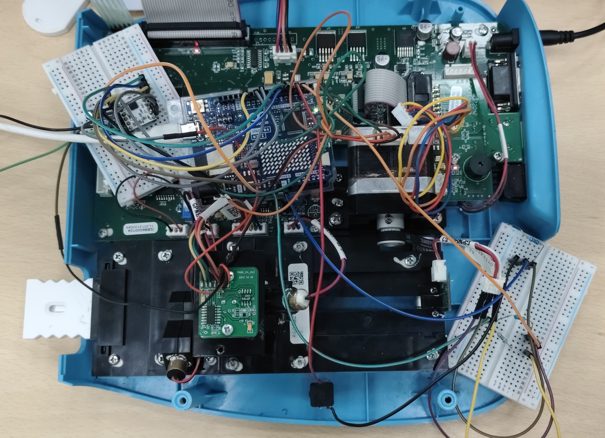

# IVD Laser Based - Strip Reader

- [IVD Laser Based - Strip Reader](#ivd-laser-based---strip-reader)
  - [Features](#features)
  - [Two motion phases](#two-motion-phases)
  - [Hardware](#hardware)
  - [Demo](#demo)

This project drives a stepper motor with a DRV8834 driver for an in-vitro diagnostic (IVD) device.
The motor positions samples for laser scanning, with homing via an optical switch (GK152) and a controlled scan routine.

  

## Features

- Homing: Uses a GK152 optical switch to find zero position, with automatic back-off.- [IVD Laser Based - Strip Reader]
- Microstepping: Configurable (default 1/16) for smooth motion.

## Two motion phases

- Fast pre-scan positioning at 300 RPM
- Slow scan at 18 RPM for laser reading
- Button input (debounced) to start a scan sequence.
- Interrupt handling: Optical switch events stop the motor safely.

## Hardware

- MCU: Arduino (tested with Arduino framework)
- Driver: DRV8834 stepper motor driver
- Motor: Nema 17 stepper motor
- Optical Switch: GK152 for homing detection
- Inputs: Push-button trigger

 

## Demo

https://github.com/user-attachments/assets/894b38b7-9e48-4f34-ba92-822ea7392790
